<div align="center">

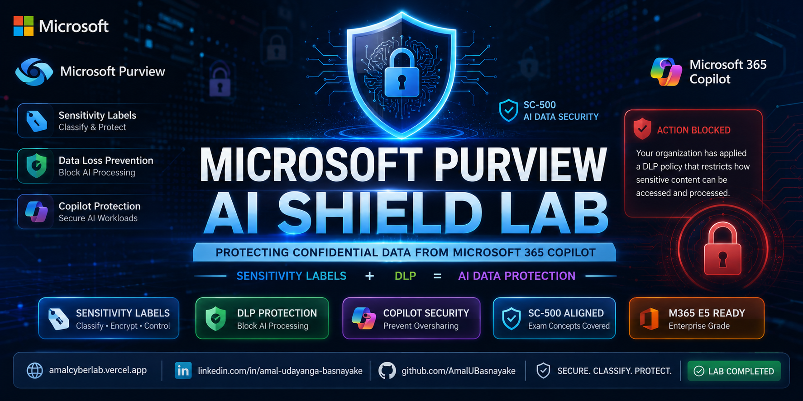

# 🔐 Microsoft Purview — AI Shield Lab

### Protecting Confidential Data from Microsoft 365 Copilot using Sensitivity Labels + DLP

[](https://microsoft.com/purview)
[](https://learn.microsoft.com/en-us/credentials/certifications/exams/sc-500/)
[](https://microsoft.com)
[](https://microsoft.com/purview)
[](https://github.com/AmalUBasnayake)

</div>

---

## 📌 Overview

As organizations rapidly adopt **Microsoft 365 Copilot**, a critical security challenge emerges:

> **Copilot surfaces ANY data the user has access to — including confidential files, HR records, and restricted documents.**

Without proper data governance controls, Copilot can inadvertently expose sensitive organizational data to unauthorized users or process it in ways that violate data protection policies.

This lab demonstrates a complete **enterprise data protection strategy** using **Microsoft Purview** to:

- Classify sensitive data with **Sensitivity Labels**
- Enforce encryption and access controls at the label level
- **Block Copilot from processing confidential data** using DLP policies
- Simulate the DLP enforcement experience in Microsoft 365 Copilot

> 🎯 This lab directly maps to **SC-500: Microsoft Cloud & AI Security Engineer Associate** objectives — specifically **Purview DSPM for AI**, **Sensitivity Labels**, and **DLP policy enforcement** for AI workloads.

---

## 🏗️ Lab Architecture

<div align="center">

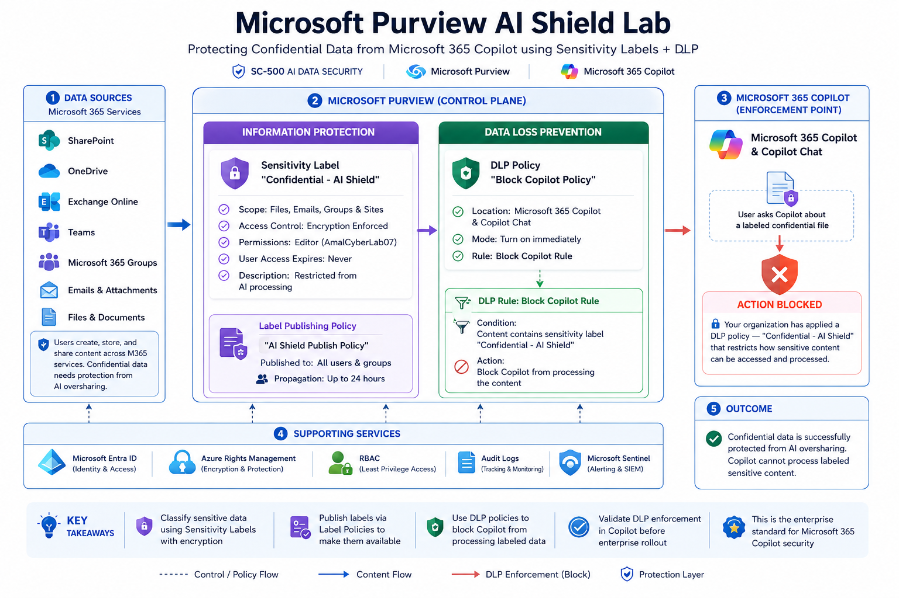


---

## 🔐 Security Concepts Demonstrated

| Concept | Implementation | SC-500 Relevance |
|---|---|---|
| **Sensitivity Labels** | "Confidential - AI Shield" with encryption | Purview Information Protection |
| **Label Access Control** | Editor permissions, user expiry Never | Data classification controls |
| **Label Publishing** | AI Shield Publish Policy → All users | Label policy deployment |
| **DLP for AI** | Block Copilot from processing labeled content | Purview DSPM for AI |
| **Copilot Data Protection** | DLP enforcement in Copilot Chat | M365 Copilot security governance |
| **RBAC for Purview** | Information Protection Admins role | Least privilege administration |
| **M365 E5 Licensing** | E5 + Entra ID P2 required for full feature set | License requirements |

---

## 📸 Lab Walkthrough

### ✅ Step 1 — Assign Required Licenses

Microsoft 365 E5 and Microsoft Entra ID P2 licenses assigned to the lab user account.

> **SC-500 Exam Point:** Sensitivity Labels with encryption and DLP for AI workloads require **Microsoft 365 E5** or **Microsoft Purview Information Protection** add-on. Entra ID P2 enables Identity Protection and PIM features used alongside Purview.

<p align="center">
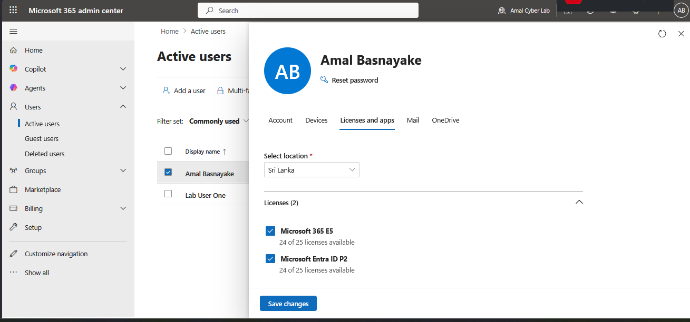
</p>

---

### ✅ Step 2 — Assign Information Protection Admin Role

The user is added to the **Information Protection Admins** role group in Microsoft Purview — granting permissions to create sensitivity labels and DLP policies.

> **SC-500 Security Note:** Always follow least privilege. Information Protection Admins can manage labels and policies but do not have full Purview Global Admin access. Role assignment may take up to 1 hour to propagate.

<p align="center">
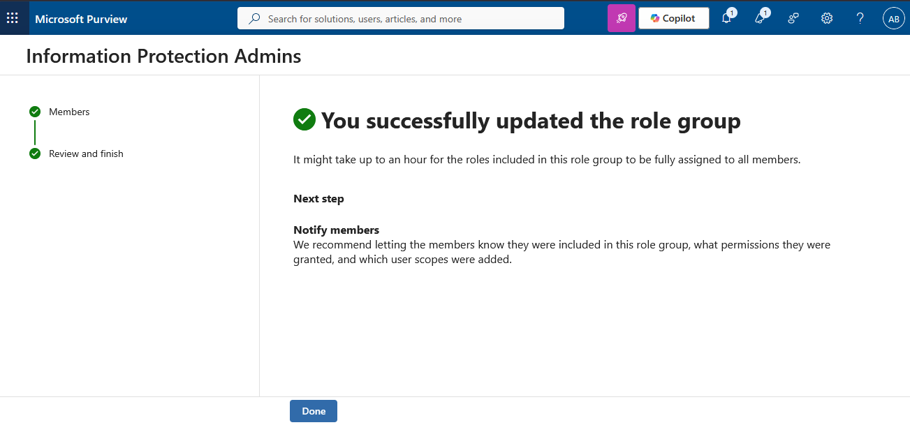
</p>

---

### ✅ Step 3 — Create Sensitivity Label: "Confidential - AI Shield"

A new sensitivity label is created in Microsoft Purview with the following configuration:

- **Name:** Confidential - AI Shield
- **Display Name:** Confidential - AI Shield
- **Description:** This data is highly confidential and restricted from AI processing
- **Scope:** Files & other data assets, Email

<p align="center">
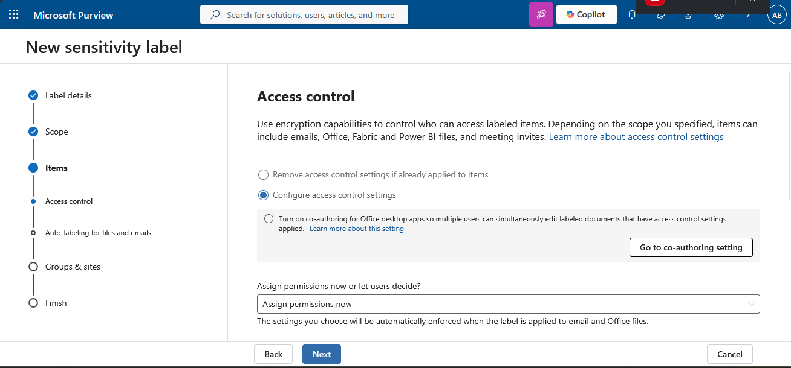
</p>

---

### ✅ Step 4 — Configure Access Control (Encryption)

Access control settings configured to **encrypt** all content labeled as "Confidential - AI Shield":

- **Assign permissions now** — encryption enforced when label is applied
- **User access expires:** Never
- **Allow offline access:** Always
- **Permissions assigned to:** AmalCyberLab07.onmicrosoft.com
- **Permission level:** Editor (View, Edit, Save, Print, Copy, Forward)

> **SC-500 Concept:** Sensitivity label encryption is enforced at the file level — even if the file is shared externally, only authorized users can decrypt and access the content. This is enforced by Azure Rights Management (Azure RMS) under the hood.

<p align="center">

</p>

---

### ✅ Step 5 — Assign Label Permissions

Specific permissions assigned to the authorized user account with **Editor** rights — granting full read/write access while maintaining label-level encryption.

<p align="center">
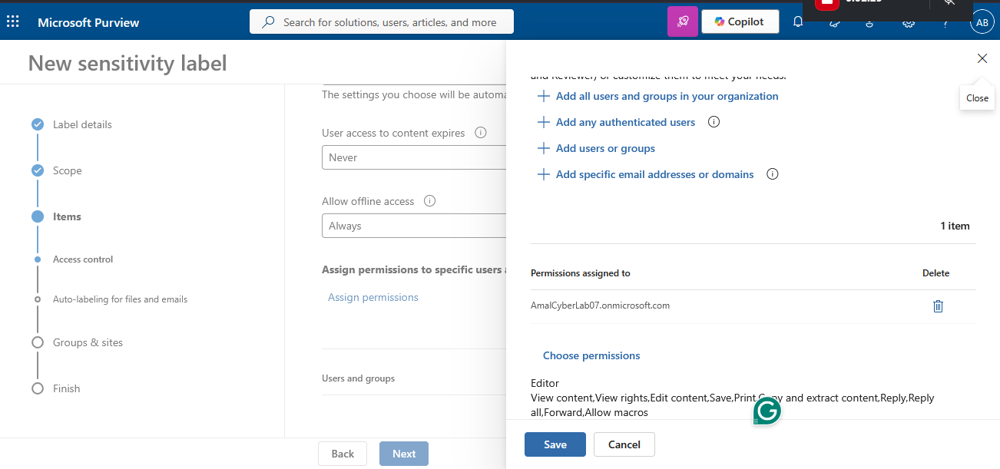
</p>

---

### ✅ Step 6 — Review Label Settings and Create

Final review of the "Confidential - AI Shield" sensitivity label settings before creation:

- **Name:** Confidential - AI Shield
- **Scope:** Files & other data assets, Email
- **Access control:** Configured with encryption
- **Description:** This data is highly confidential and restricted from AI processing

<p align="center">
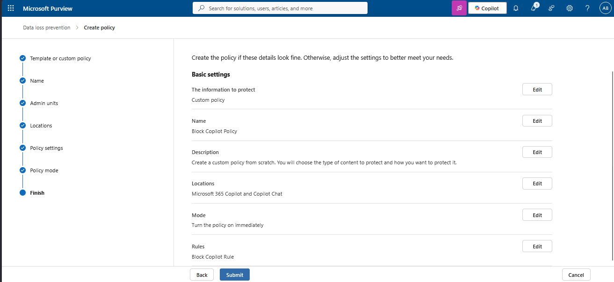
</p>

---

### ✅ Step 7 — Label Successfully Created

The "Confidential - AI Shield" sensitivity label is created successfully in Microsoft Purview.

> **Next Step:** Publish the label via a Label Policy so users can apply it in Office apps, SharePoint, Teams, and Microsoft 365 Groups.

<p align="center">
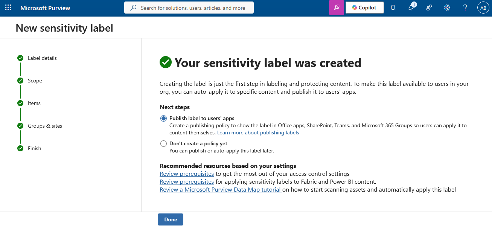
</p>

---

### ✅ Step 8 — Published Label in Purview

The sensitivity label is now visible in the Microsoft Purview Information Protection portal.

<p align="center">
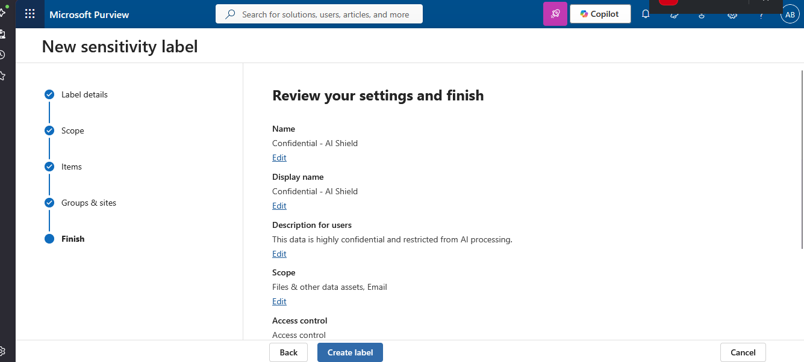
</p>

---

### ✅ Step 9 — Create Label Publishing Policy: "AI Shield Publish Policy"

A label publishing policy is created to make the "Confidential - AI Shield" label available to users across Microsoft 365 apps.

- **Policy Name:** AI Shield Publish Policy
- **Labels to publish:** Confidential - AI Shield
- **Published to:** All users and groups

> **SC-500 Exam Point:** Creating a sensitivity label is NOT enough — you must publish it via a Label Policy before users can apply it in Office apps, SharePoint, or Teams. Label publishing can take **up to 24 hours** to propagate.

<p align="center">
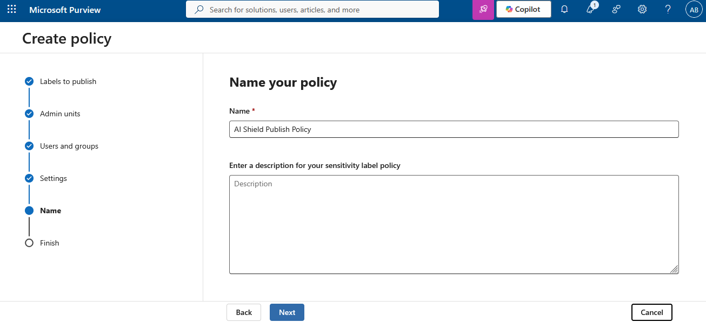
</p>

---

### ✅ Step 10 — Label Policy Published and Syncing

The "AI Shield Publish Policy" appears in the Label Policies dashboard with status **Sync in progress** — confirming successful creation and deployment.

<p align="center">
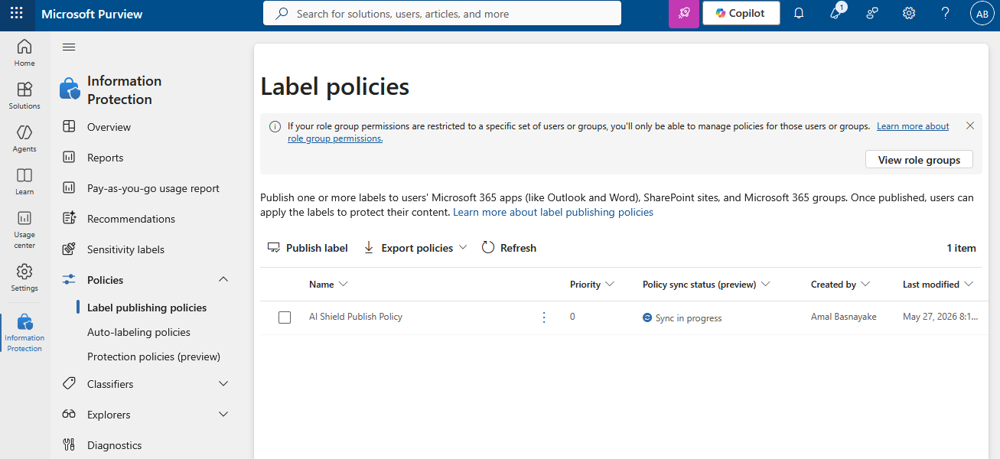
</p>

---

### ✅ Step 11 — Create DLP Policy: "Block Copilot Policy"

A **Data Loss Prevention (DLP)** policy is created targeting **Microsoft 365 Copilot and Copilot Chat** to enforce data protection when AI processes labeled content.

**DLP Policy Configuration:**
- **Policy Name:** Block Copilot Policy
- **Location:** Microsoft 365 Copilot and Copilot Chat
- **Mode:** Turn on immediately
- **Rule:** Block Copilot Rule

**DLP Rule Configuration:**
- **Rule Name:** Block Copilot Rule
- **Condition:** Content contains sensitivity label → **Confidential - AI Shield**
- **Action:** Block Copilot from processing the content

> **SC-500 Critical Concept:** DLP policies targeting **Microsoft 365 Copilot** are the enterprise control to prevent AI from processing sensitive labeled data. This directly addresses the **oversharing risk** that Copilot introduces — where AI can surface any content the user has access to.

<p align="center">
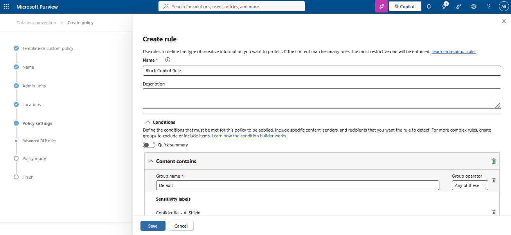
</p>

---

### ✅ Step 12 — DLP Policy Review and Submission

Final review of the "Block Copilot Policy" before submission:

- **Information to protect:** Custom policy
- **Location:** Microsoft 365 Copilot and Copilot Chat
- **Mode:** Turn on immediately
- **Rule:** Block Copilot Rule

<p align="center">
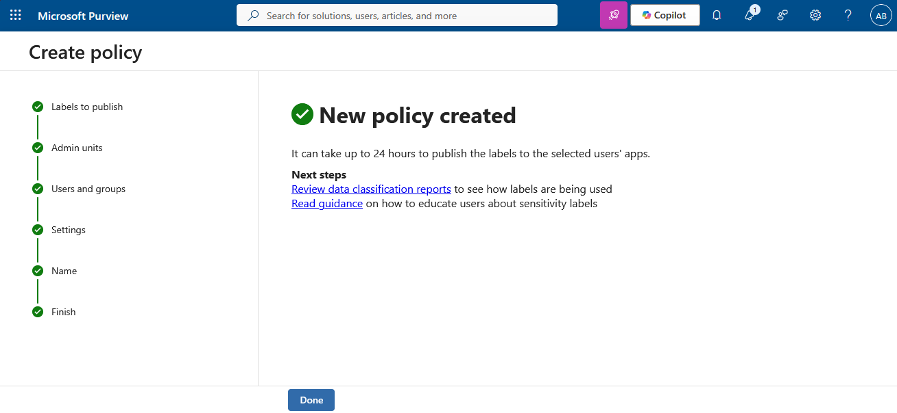
</p>

---

### ✅ Step 13 — DLP Enforcement Validated in Microsoft 365 Copilot

The DLP policy enforcement is validated by simulating a Copilot interaction with a document labeled "Confidential - AI Shield."

**Copilot's response when attempting to process the protected document:**

> ⚠️ **Action Blocked by Your Organization's Data Protection Policy**
>
> We can't proceed with your request.
>
> Your organization has applied a Microsoft Purview Data Loss Prevention (DLP) policy — **"Confidential - AI Shield"** — that restricts how sensitive content can be accessed and processed.

<p align="center">
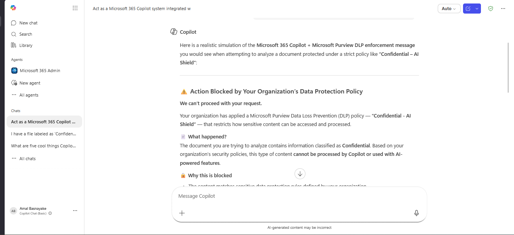
</p>

<p align="center">
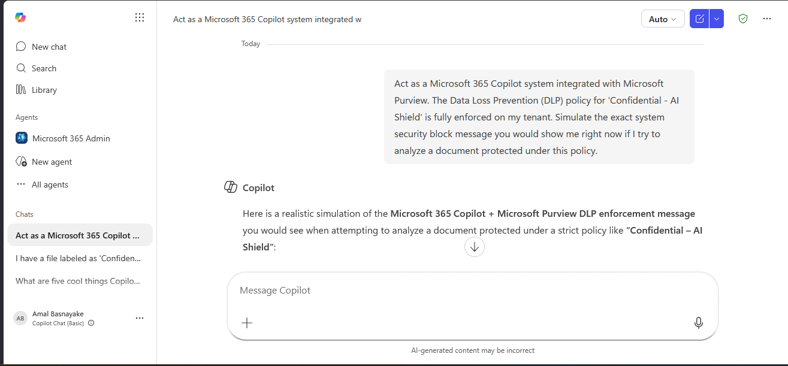
</p>

> **Lab Result:** ✅ Microsoft 365 Copilot is successfully blocked from processing content labeled "Confidential - AI Shield" — demonstrating enterprise-grade AI data protection using Microsoft Purview DLP.

---

## 🧪 Test Scenarios

| Scenario | Label Applied | DLP Policy | Copilot Result |
|---|---|---|---|
| Regular business document | None | No match | ✅ Copilot can process |
| HR salary spreadsheet | Confidential - AI Shield | Match → Block rule | 🚫 Copilot blocked |
| Confidential strategy doc | Confidential - AI Shield | Match → Block rule | 🚫 Copilot blocked |
| Public announcement | None | No match | ✅ Copilot can process |

---

## ☁️ Lab Environment

| Component | Value |
|---|---|
| Tenant | AmalCyberLab07.onmicrosoft.com |
| Licenses | Microsoft 365 E5 + Microsoft Entra ID P2 |
| Admin Role | Information Protection Admins |
| Sensitivity Label | Confidential - AI Shield |
| Label Policy | AI Shield Publish Policy |
| DLP Policy | Block Copilot Policy |
| DLP Location | Microsoft 365 Copilot and Copilot Chat |
| DLP Mode | Turn on immediately |

---

## 🔐 SC-500 Exam Concepts Covered

| SC-500 Objective | What This Lab Demonstrates |
|---|---|
| Configure Sensitivity Labels | "Confidential - AI Shield" with encryption + access control |
| Publish Label Policies | AI Shield Publish Policy → All users |
| Implement DLP for AI workloads | Block Copilot Policy targeting M365 Copilot location |
| Purview DSPM for AI | Prevent AI from processing labeled sensitive data |
| Protect data in Copilot | DLP enforcement validated in Copilot Chat |
| Least privilege administration | Information Protection Admins role — not Global Admin |
| License requirements | M365 E5 required for full Purview + Copilot DLP feature set |

---

## 💡 Key Takeaways

### 1. Labels Without DLP = Incomplete Protection

Creating a sensitivity label provides classification and encryption — but Copilot can still *reference* labeled content unless a DLP policy explicitly blocks it. Both controls are needed.

### 2. DLP Location Matters

The DLP policy must target **"Microsoft 365 Copilot and Copilot Chat"** as the location — this is the specific control point for AI processing. Existing Exchange or SharePoint DLP policies do NOT automatically apply to Copilot.

### 3. Publishing Takes Time

Label policy publishing can take **up to 24 hours** to propagate across all M365 apps. Plan lab timing accordingly.

### 4. This Is the Enterprise Copilot Security Standard

Before deploying M365 Copilot to an organization, security teams should:
1. Run **Purview DSPM for AI** to discover oversharing
2. Apply **Sensitivity Labels** to confidential content
3. Create **DLP policies** targeting Copilot locations
4. Test enforcement before broad rollout

---

## 🛣️ Roadmap

- [ ] Auto-labeling policy for sensitive content (credit cards, PII)
- [ ] Insider Risk Management integration
- [ ] Purview Audit log monitoring for label events
- [ ] Microsoft Sentinel alert on DLP policy matches
- [ ] Communication Compliance policy
- [ ] Purview DSPM for AI dashboard review

---

## 📂 Project Structure

```
purview-ai-shield-dlp-lab/
├── README.md
└── images/
    ├── banner.png
    ├── add_E5.png
    ├── Information_protection_admins.png
    ├── create_sensitivity_label.png
    ├── create_lable.png
    ├── label.png
    ├── permissions_assigned.png
    ├── summery_setting.png
    ├── create_policy.png
    ├── Label_policies.png
    ├── DLP_rules_create.png
    ├── policy.png
    ├── final_output_test.png
    └── final_output_test_MSG.png
```

---

## 🏷️ GitHub Topics

```
microsoft-purview  sensitivity-labels  dlp  data-loss-prevention
copilot-security  ai-security  sc500  microsoft-365  information-protection
cloud-security  purview-dspm  responsible-ai  m365-security  azure-security
```

---

## 📄 License

MIT License — Feel free to use in your security projects.

---

<div align="center">

**Amal Udayanga Basnayake**

Cloud & AI Security  | Azure Security | SC-500 | AZ-500

[](https://linkedin.com/in/amal-udayanga-basnayake)
[](https://amalcyberlab.vercel.app)
[](https://github.com/AmalUBasnayake)
[](https://credly.com/users/amaludayanga-basnayake)

---

🔐 *Protecting Enterprise Data from AI Oversharing Through Microsoft Purview*

*Built with Microsoft Purview Information Protection + Data Loss Prevention*

⭐ If this project helped you, consider giving it a star!

</div>
